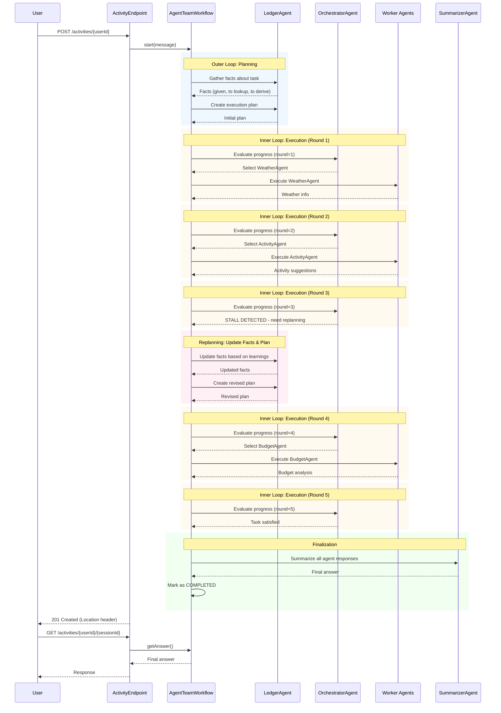

# Adaptive Multi-Agent System

A sample application demonstrating how to build a multi-agent system using Akka and an LLM model.

## Overview

This project illustrates an Agentic workflow for a multi-agent system using Akka. The system:

- Processes user queries and determines the appropriate agents to handle the request
- Plans the execution order of the selected agents
- Executes the plan by interacting with the agents in sequence
- Summarizes the results from all agents into a final response

### Akka components

This sample leverages specific Akka components:

- **Workflow**: Manages the user query process, handling the sequential steps of agent selection, plan creation, execution, and summarization.
- **EventSourced Entity**: Maintains the session memory, storing the sequence of interactions between the user and the system.
- **HTTP Endpoint**: Serves the application endpoints for interacting with the multi-agent system (`/activities`).

### Other

- **LLM model**: The system uses an LLM model to assist in agent selection, plan creation, and summarization. The LLM is integrated with tools specific to each agent's domain of expertise.

## Adaptive Orchestration

This sample also includes an implementation of the **MagenticOne** orchestration pattern - an adaptive multi-agent system that re-evaluates progress after each agent response and dynamically adjusts its strategy.

### Key Features

- **Adaptive Planning**: Unlike a static workflow, MagenticOne continuously evaluates progress and can change direction
- **Stall Detection**: Automatically detects when agents are stuck in loops or not making progress
- **Dynamic Replanning**: When stalled, the system updates its understanding and creates a new plan
- **Fact Sheet Evolution**: Maintains an evolving understanding of the problem that improves over time

### How It Works

MagenticOne uses two loops:

**Outer Loop** (Planning):
1. Gather facts about the task
2. Create an execution plan based on available agents

**Inner Loop** (Execution):
1. Evaluate current progress (is task complete? making progress? stuck?)
2. Select next agent to execute based on evaluation
3. Execute selected agent
4. Repeat until task complete or replanning needed

If the system detects stalling (e.g., repeated actions, lack of progress), it re-enters the outer loop to replan with updated knowledge.

### Call Flow Diagram

The following sequence diagram illustrates the adaptive orchestration flow:



**Key aspects illustrated:**
- **Outer Loop (Blue)**: Initial fact gathering and plan creation by LedgerAgent
- **Inner Loop (Orange)**: Iterative evaluation and agent execution coordinated by OrchestratorAgent
- **Replanning (Pink)**: Triggered when stalls are detected, updates facts and creates new plan
- **Finalization (Green)**: SummarizerAgent combines all responses into final answer

Each round, the OrchestratorAgent evaluates progress by checking the session memory (conversation history) and decides whether to continue with another agent, replan, or finish.

### MagenticOne Components

- **LedgerAgent**: Manages the task ledger (facts and execution plan)
- **OrchestratorAgent**: Evaluates progress after each turn and selects the next agent
- **AgentTeamWorkflow**: Coordinates the outer and inner loops
- **Worker Agents**:
  - **WeatherAgent**: Provides weather forecasts and conditions
  - **ActivityAgent**: Suggests real-world activities (sports, games, attractions)
  - **RestaurantAgent**: Recommends dining options based on location, cuisine, and budget
  - **TransportAgent**: Provides navigation and public transport information
  - **BudgetAgent**: Tracks costs and manages budget constraints
  - **EventAgent**: Finds local events, exhibitions, and cultural happenings

### Benefits Over Static Planning

| Feature | Static Planning | MagenticOne |
|---------|----------------|-------------|
| **Adaptability** | Fixed plan upfront | Adjusts based on results |
| **Error Recovery** | Retries same plan | Detects issues and replans |
| **Complex Tasks** | Limited to predefined steps | Handles open-ended problems |
| **Agent Selection** | All agents planned initially | Selects agents as needed |

The MagenticOne pattern is ideal for complex, unpredictable tasks where the optimal path isn't known upfront.

### Example: Adaptive Planning in Action

Consider this complex request:

> "Plan a weekend in Barcelona with my family (2 adults, 2 kids aged 8 and 10). Budget is 600 euros total.
> Find kid-friendly activities, family restaurants, and check if there are any special events this weekend.
> We're staying near Sagrada Familia."

**MagenticOne's Adaptive Flow:**

**Round 1** - Orchestrator selects WeatherAgent and EventAgent
- Weather: Sunny Saturday, rainy Sunday afternoon
- Events: Children's festival at Parc de la Ciutadella on Saturday

**Round 2** - Based on weather + events, selects ActivityAgent
- Saturday: Outdoor activities + festival
- Sunday morning: Indoor museums (Aquarium, CosmoCaixa)

**Round 3** - Orchestrator notices no dining recommendations yet, selects RestaurantAgent
- Family-friendly restaurants near activities
- Estimated 30-40 euros per meal for family

**Round 4** - Budget concern detected, orchestrator selects BudgetAgent
- **STALL DETECTED**: Budget shows 650 euros (over limit)
- System enters replanning phase

**Replanning** - Ledger updates facts with budget overage
- Updated plan: Replace one restaurant with picnic, skip paid festival activities
- New budget: 580 euros (under budget with buffer)

**Round 5** - Verify transport feasibility with TransportAgent
- Metro routes from Sagrada Familia to each location
- Total transport cost: 48 euros for weekend passes

**Round 6** - Final budget check shows 628 euros
- **STALL DETECTED AGAIN**: Still over budget
- Replanning: Switch one museum to free alternative (Parc Güell free area)

**Round 7** - Orchestrator confirms all constraints met
- Task complete: Final itinerary with budget at 590 euros

**Why This Showcases MagenticOne:**
- **Dynamic Adaptation**: Weather influenced activity selection
- **Iterative Refinement**: Multiple budget adjustments based on actual totals
- **Stall Detection**: Automatically caught budget violations twice
- **Context-Aware**: Transport recommendations considered family base location
- **Replanning**: Created new plan when original exceeded constraints

**Static Planning Would:**
- Call all agents upfront in fixed order
- Miss the budget violation until the end
- Not adapt activities based on weather findings
- Require manual intervention to fix budget issues

## Running the application

### Prerequisites
- Java 21 or higher
- Maven 3.6 or higher

### Build and run

To run the application, you need to provide the following environment variable:
- `OPENAI_API_KEY`: Your OpenAI API key. If you prefer to use a different LLM model, follow the instructions in `application.conf` to change it.

**Note:** Weather information is simulated using randomized data. No external weather API is required.

Set the environment variable:

- On Linux or macOS:

  ```shell
  export OPENAI_API_KEY=your-openai-api-key
  ```

- On Windows (command prompt):

  ```shell
  set OPENAI_API_KEY=your-openai-api-key
  ```

Build and run the application:
```shell
# Run the application
mvn compile exec:java
```

### Testing the agents

With the application running, you can test the system using the following endpoints:

#### Simple Query

Start a new session with a simple query:
```shell
curl -i -XPOST --location "http://localhost:9000/activities/alice" \
  --header "Content-Type: application/json" \
  --data '{"message": "I do not work tomorrow. I am in Madrid. What should I do? Beware of the weather"}'
```

#### Complex Query (Shows Adaptive Orchestration)

Test MagenticOne's adaptive capabilities with a complex, multi-constraint request:
```shell
curl -i -XPOST --location "http://localhost:9000/activities/bob" \
  --header "Content-Type: application/json" \
  --data '{
    "message": "Plan a weekend in Barcelona with my family (2 adults, 2 kids aged 8 and 10). Budget is 600 euros total. Find kid-friendly activities, family restaurants, and check if there are any special events this weekend. We are staying near Sagrada Familia."
  }'
```

This complex query will trigger:
- Multiple agent interactions (weather, events, activities, restaurants, budget, transport)
- Adaptive planning based on weather conditions
- Budget constraint validation and replanning if needed
- Transport feasibility checks based on location

#### Retrieve Results

Get the response for a specific session:
```shell
curl -i -XGET --location "http://localhost:9000/activities/{userId}/{sessionId}"
```

Replace `{userId}` and `{sessionId}` with the values from your request. Example:

```shell
$ curl "http://localhost:9000/activities/alice/c1219e5a-abae-44c0-959b-ff76aa22cb2e"

The weather in Madrid is rainy tomorrow, so you might want to explore indoor attractions like the Prado Museum or Reina Sofia Museum. Alternatively, you can visit local cafes and food markets, such as Mercado de San Miguel, to enjoy some culinary delights without getting wet. If you're up for something more active, you could also consider visiting an escape room or an indoor sports facility.
```

#### Inspect Workflow State

See the full orchestration details (facts gathered, plan created, agent interactions, replanning events):
```shell
curl -i -XGET --location "http://localhost:9000/activities/{userId}/{sessionId}/state"
```

The state response includes:
- Initial facts gathered about the task
- Execution plan created by the LedgerAgent
- Complete message history showing agent interactions
- Progress evaluation decisions by the OrchestratorAgent
- Replanning events when stalls are detected
- Final status and completion details

## Deployment

You can use the [Akka Console](https://console.akka.io) to create a project and deploy this service.

Build container image:
```shell
mvn clean install -DskipTests
```
Install the `akka` CLI as documented in [Install Akka CLI](https://doc.akka.io/operations/cli/installation.html).

Set up secret containing OpenAI API key:
```shell
akka secret create generic agent-secrets \
  --literal openai-key=$OPENAI_API_KEY
```

Deploy the service using the image tag from above `mvn install` and the secret:
```shell
akka service deploy multi-agent multi-agent:<tag-name> --push \
  --secret-env OPENAI_API_KEY=agent-secrets/openai-key
```

Refer to [Deploy and manage services](https://doc.akka.io/operations/services/deploy-service.html)
for more information.

To understand the Akka concepts that are the basis for this example, see [Development Process](https://doc.akka.io/concepts/development-process.html) in the documentation.
